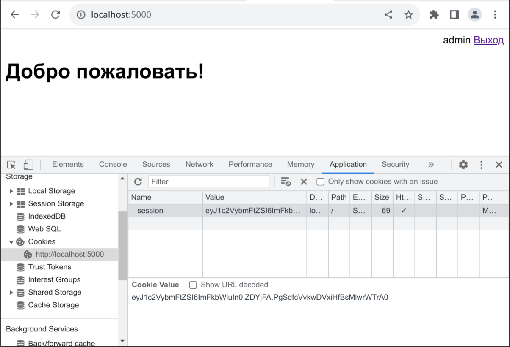

# Flask-4

## Предварительные шаги

1. Откройте каталог проекта в редакторе VS Code

2. Создайте и активируйте виртуальное окружение 

Powershell:

```powershell
py -m venv venv
.\venv\scripts\activate.ps1
```

Командная строка:

```cmd
py -m venv venv
venv\scripts\activate.bat
```

3. Установите библиотеки используя список из `requirements.txt`:

```powershell
pip install -r requirements.txt
```

4. Инициализируйте базу данных:

```powershell
flask db init
flask db migrate -m "Initial migration"
flask db upgrade
```

5. Разрешите отладку и запустите веб-сервер разработчика:

Powershell:

```powershell
$ENV:FLASK_DEBUG=1
flask run
```

Командная строка:

```cmd
set FLASK_DEBUG=1
flask run
```

## Сессии

1. Добавьте шаблон страницы аутентификации `login.html`:

```html



<h1>Вход на сайт</h1>
<form method="post">

    <div class="row">
        <label>Логин</label>
        <input type="text" name="username" value="{{ username }}">
    </div>

    <div class="row">
        <label>Пароль</label>
        <input type="password" name="password">
    </div>

    <div class="row">
        <input type="submit" value="Войти">
        <a href="{{ url_for('index_page') }}">Отмена</a>
    </div>
</form>

```

2. Добавьте функцию `login_page()` во `views.py`:

```python
def login_page():
    username = ""
    if request.method == "POST":
        username = request.form.get("username")
        password = request.form.get("password")
        # Учебный пример проверки логина и пароля
        # В реальных приложениях проверка выполняется с помощью KDF-функций
        if username == "admin" and password == "pass":
            session["username"] = username
            return redirect(url_for("index_page"))
    return render_template("login.html", username=username)
```

3. Добавьте функцию `logout()` во `views.py`:

```python
def logout():
    session.pop("username")
    return redirect(url_for("index_page"))
```

4. Исправьте импорты недостающих функций во `views.py` из пакета `flask`

5. Добавьте секретный ключ (для шифрования данных сессии) в `create_app()`:

```python
app.config["SECRET_KEY"] = "secret"
```

6. Добавьте соответствующие правила для URL в `create_app()`:

```python
app.add_url_rule("/login/", view_func=views.login_page, methods=["GET", "POST"])
app.add_url_rule("/logout/", view_func=views.logout)
```

7. Добавьте в шаблон `index.html` навигационную панель перед заголовком:

```html
<div class="menu">
    
    <span>{{ session['username'] }}</span>
    <a href="{{ url_for('logout') }}">Выход</a>
    
    <a href="{{ url_for('login_page') }}">Вход</a>
    
</div>
```

8. Проверьте работу механизма аутентификации

9. Удалите Cookie и проверьте что это приводит к очистке данных сессии:



10. Сделайте коммит

## Создание админки

1. Добавьте класс для таблицы студентов в файл `models.py`:

```python
class Student(db.Model):
    pk = db.Column(db.Integer(), primary_key=True)
    last_name = db.Column(db.String(30), nullable=False)
    first_name = db.Column(db.String(30), nullable=False)
    second_name = db.Column(db.String(30))

    def __str__(self):
        return f"{self.last_name} {self.first_name}"
```

2. Выполните реструктуризацию данных:

```powershell
flask db migrate -m "Add Students table"
flask db upgrade
```

3. Добавьте файл `admin.py`:

```python
from flask_admin import Admin
from flask_admin.contrib.sqla import ModelView

admin = Admin()


class StudentModelView(ModelView):
    pass
```

4. Добавьте админку в `create_app()`:

```python
admin.init_app(app)
admin.add_view(StudentModelView(models.Student, db.session))
```

и соответствующие импорты

```python
from .admin import admin, StudentModelView
```

5. Добавьте ссылку на админку в меню рядом с именем вошедшего пользователя:

```html
<a href="{{ url_for('admin.index') }}">Админка</a>
```

6. Проверьте работу админки

7. Сделайте коммит

## Создание связей между таблицами

1. Добавьте новую таблицу `Group` в `models.py`:

```python
class Group(db.Model):
    pk = db.Column(db.Integer(), primary_key=True)
    name = db.Column(db.String(30), nullable=False)
    students = db.relationship("Student", back_populates="group")

    def __str__(self):
        return f"{self.name}"
```

2. В класс `Student` добавьте внешний ключ:

```python
group_pk = db.Column(db.ForeignKey("group.pk"))
group = db.relationship("Group", back_populates="students")
```

3. Выполните реструктуризацию данных:

```powershell
flask db migrate -m "Add Groups table"
flask db upgrade
```

4. Добавьте класс `GroupModelView` и исправьте код класса `StudentModelView` в файле `admin.py`:

```python
class GroupModelView(ModelView):
    passform_columns = ('name', 'students')

class StudentModelView(ModelView):
    form_columns = ('last_name', 'first_name', 'second_name', 'group')
```

5. Добавьте страницу для учебных групп в админку в `create_app()`:

```python
admin.add_view(GroupModelView(models.Group, db.session))
```

и добавьте `GroupModelView` в импорты из `.admin`

6. Проверьте работу админки

7. Сделайте коммит

## Ссылки

* [Документация Flask](https://flask.palletsprojects.com/)
* [Документация Flask-SqlAlchemy](https://flask-sqlalchemy.palletsprojects.com/)
* [Документация Flask-Migrate](https://flask.palletsprojects.com/)
* [Документация Flask-Admin](https://flask-admin.readthedocs.io/)
* [Документация SqlAlchemy](https://www.sqlalchemy.org/)
* [Документация Alembic](https://alembic.sqlalchemy.org/)
* [KDF-функции](https://en.wikipedia.org/wiki/Key_derivation_function)
